# PygameNode 事件系统文档

## 事件类层级结构

```mermaid
classDiagram
    class Event {
        <<abstract>>
    }
    class PointerEvent {
        +MouseButton button_index
        +Vector2 pos
    }
    class KeyEvent {
        +int keycode
    }
    class WindowEvent {
        +int window
    }
    class PointerMoveEvent {
        +Vector2 pos
        +Vector2 rel
        +tuple buttons
    }
    
    Event <|-- PointerEvent
    Event <|-- KeyEvent
    Event <|-- WindowEvent
    Event <|-- PointerMoveEvent
    PointerEvent <|-- PointerDownEvent
    PointerEvent <|-- PointerUpEvent
    PointerEvent <|-- PointerClickEvent
    KeyEvent <|-- KeyDownEvent
    KeyEvent <|-- KeyUpEvent
    WindowEvent <|-- WindowDropFileEvent
```

## Event 基类
所有事件类的基类, 提供通用的事件处理接口. 

### 属性
无具体属性, 作为抽象基类使用. 

## PointerEvent 事件
继承自 [`Event`](#event), 表示指针（鼠标）相关事件. 

### 属性

| 类型              | 属性             | 说明      | 默认值                 |
|-----------------|----------------|---------|---------------------|
| **MouseButton** | `button_index` | 鼠标按键标识符 | `MOUSE_BUTTON_NONE` |
| **Vector2**     | `pos`          | 鼠标位置坐标  | `Vector2(0, 0)`     |

### 子类
1. [`PointerDownEvent`](#pointerdownevent) 指针按下事件
2. [`PointerUpEvent`](#pointerupevent) 指针松开事件
3. [`PointerClickEvent`](#pointerclickevent) 指针点击事件

## PointerDownEvent 事件
继承自 [`PointerEvent`](#pointerevent), 表示指针按下事件. 

### 属性
继承自 [`PointerEvent`](#pointerevent-property), 无额外属性. 

## PointerUpEvent 事件
继承自 [`PointerEvent`](#pointer-event), 表示指针松开事件. 

### 属性
完全继承自 [`PointerEvent`](#pointerevent-property), 无额外属性. 

## PointerClickEvent 事件
继承自 [`PointerEvent`](#pointer-event), 表示指针完整点击事件（按下+释放）. 

### 属性
完全继承自 [`PointerEvent`](#pointerevent-property), 无额外属性. 

## PointerMoveEvent 事件
继承自 [`Event`](#event), 表示指针移动事件. 

### 属性

| 类型          | 属性        | 说明      | 默认值             |
|-------------|-----------|---------|-----------------|
| **Vector2** | `pos`     | 当前指针位置  | `Vector2(0, 0)` |
| **Vector2** | `rel`     | 指针相对位移值 | `Vector2(0, 0)` |
| **tuple**   | `buttons` | 按键状态元组  | `(0, 0, 0)`     |

## KeyEvent 事件
继承自 [`Event`](#event), 表示键盘按键事件. 

### 属性

| 类型      | 属性        | 说明   | 默认值  |
|---------|-----------|------|------|
| **int** | `keycode` | 按键编码 | 无默认值 |

### 子类
1. [`KeyDownEvent`](#keydownevent) 按键按下事件
2. [`KeyUpEvent`](#keyupevent) 按键松开事件

## KeyDownEvent 事件
继承自 [`KeyEvent`](#keyevent), 表示按键按下事件. 

### 属性
完全继承自 [`KeyEvent`](#keyevent-property), 无额外属性. 

## KeyUpEvent 事件
继承自 [`KeyEvent`](#keyevent), 表示按键松开事件. 

### 属性
完全继承自 [`KeyEvent`](#keyevent-property), 无额外属性. 

## WindowEvent 事件
继承自 [`Event`](#event), 表示窗口相关事件. 

### 属性

| 类型      | 属性       | 说明    | 默认值  |
|---------|----------|-------|------|
| **int** | `window` | 窗口标识符 | 无默认值 |

### 子类
1. [`WindowDropFileEvent`](#windowdropfileevent) 窗口文件拖放事件

## WindowDropFileEvent 事件
继承自 [`WindowEvent`](#windowevent), 表示文件拖放到窗口事件. 

### 属性
继承自[`WindowEvent`](#windowevent-property), 额外属性:

| 类型               | 属性     | 说明     | 默认值  |
|------------------|--------|--------|------|
| **pathlib.Path** | `file` | 拖放文件路径 | 无默认值 |