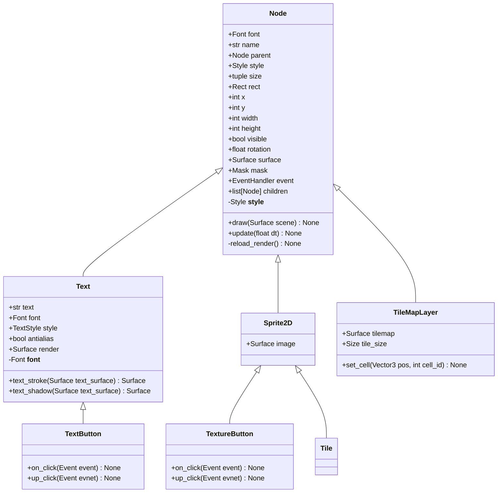

# PygameNode 系统文档

## 类层级结构

## Node 基类
UI系统中所有可视化元素的基类，提供通用的位置、大小、样式和事件处理功能。

### 属性

| 类型               | 属性         | 说明                 | 默认值              |
|------------------|------------|--------------------|------------------|
| **Font**         | `font`     | 类属性，所有节点共享的字体      | `None`           |
| **str**          | `name`     | 节点的标识名称            | 传入参数             |
| **Node**         | `parent`   | 父节点引用              | `None`           |
| **Style**        | `style`    | 节点的视觉样式配置          | `Style()`        |
| **tuple**        | `size`     | 节点的尺寸（宽度, 高度）      | `(0, 0)`         |
| **Rect**         | `rect`     | 节点的矩形区域（基于位置和大小计算） | 自动计算             |
| **int**          | `x`        | 节点在父容器中的X坐标        | `0`              |
| **int**          | `y`        | 节点在父容器中的Y坐标        | `0`              |
| **int**          | `width`    | 节点的宽度              | `0`              |
| **int**          | `height`   | 节点的高度              | `0`              |
| **bool**         | `visible`  | 节点是否可见             | `True`           |
| **float**        | `rotation` | 节点的旋转角度（度）         | `0.0`            |
| **Surface**      | `surface`  | 节点的绘制表面            | 根据尺寸创建           |
| **Mask**         | `mask`     | 节点的碰撞遮罩（用于精确碰撞检测）  | 从surface生成       |
| **EventHandler** | `event`    | 节点的事件处理器           | `EventHandler()` |
| **list[Node]**   | `children` | 子节点列表              | `[]`             |

### 方法

#### `draw(scene: Surface) -> None`
将节点绘制到指定的场景表面上。如果节点不可见则直接返回。会绘制节点的背景（如果样式中有设置背景色），包括支持圆角效果。

#### `update(dt: float) -> None`
更新节点的状态。参数`dt`表示自上次更新以来经过的时间（秒）。该方法会递归更新所有子节点的状态。

#### `reload_render() -> None`
刷新节点渲染

## Text 类
继承自 `Node`，专门用于显示文本内容的节点，支持高级文本渲染效果如描边和阴影。

### 属性

| 类型            | 属性          | 说明         | 默认值               |
|---------------|-------------|------------|-------------------|
| **str**       | `text`      | 要显示的文本内容   | 传入参数              |
| **Font**      | `font`      | 文本渲染使用的字体  | 继承自Node.font或传入参数 |
| **bool**      | `antialias` | 是否启用抗锯齿渲染  | `False`           |
| **TextStyle** | `style`     | 文本特有的样式配置  | `TextStyle()`     |
| **tuple**     | `size`      | 文本渲染后的实际尺寸 | 根据文本内容计算          |
| **Surface**   | `render`    | 渲染后的文本表面   | 根据文本和样式生成         |

### 方法

#### `draw(scene: Surface) -> None`
重写父类的绘制方法，先调用父类方法绘制背景，然后渲染文本。支持描边和阴影等高级效果。

#### `text_stroke(text_surface: Surface) -> Surface`
为文本表面添加描边效果。通过在多方向偏移绘制来实现描边，返回处理后的表面。

#### `text_shadow(text_surface: Surface) -> Surface`
为文本表面添加阴影效果。根据样式中的阴影配置计算阴影位置和透明度，返回处理后的表面。

#### `reload_render() -> None`
刷新文本渲染.

## TextButton 类
继承自 `TextNode`，专门用于创建可交互的文本按钮，自动处理点击事件。

### 属性
完全继承自 `TextNode`，无额外属性。

### 方法

#### `on_click(event: PointerClickEvent) -> None`
按钮点击事件的处理方法。

#### `up_click(event: PointerClickEvent) -> None`
按钮松开事件的处理方法。
